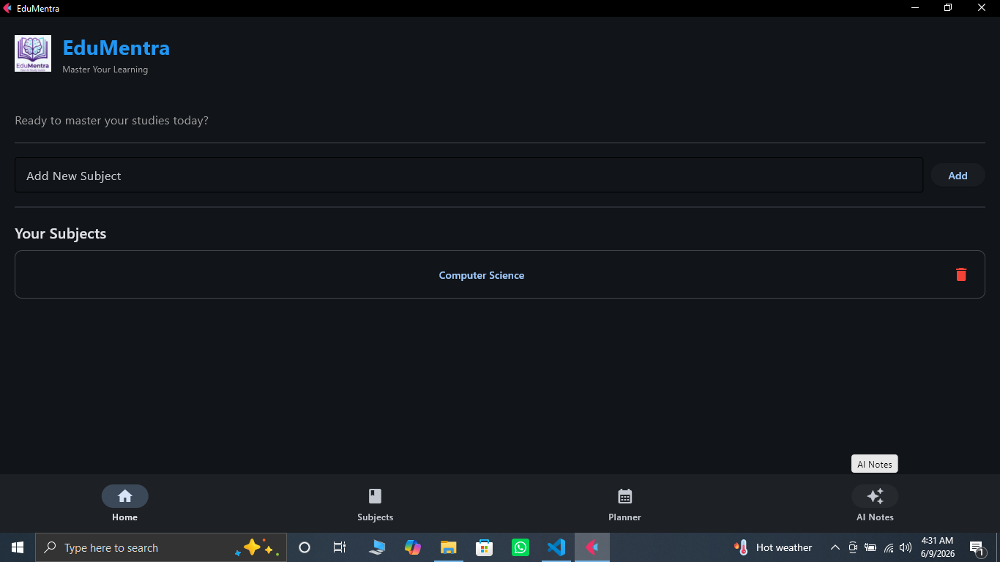
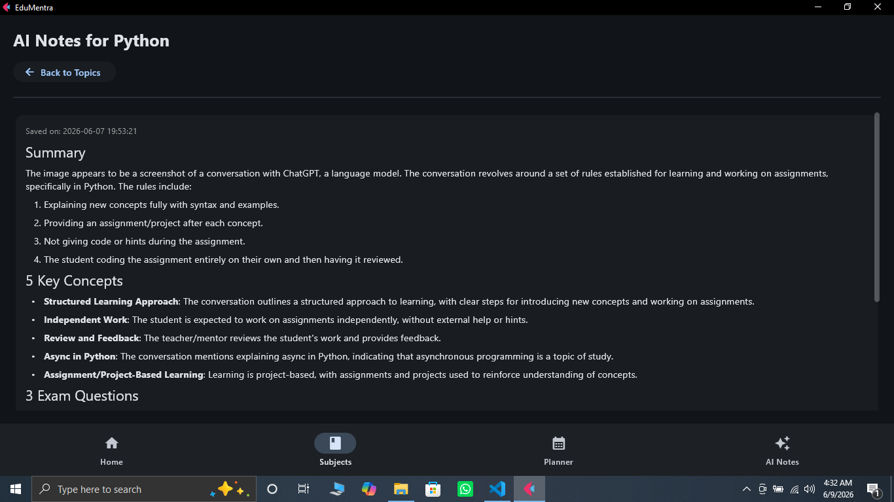
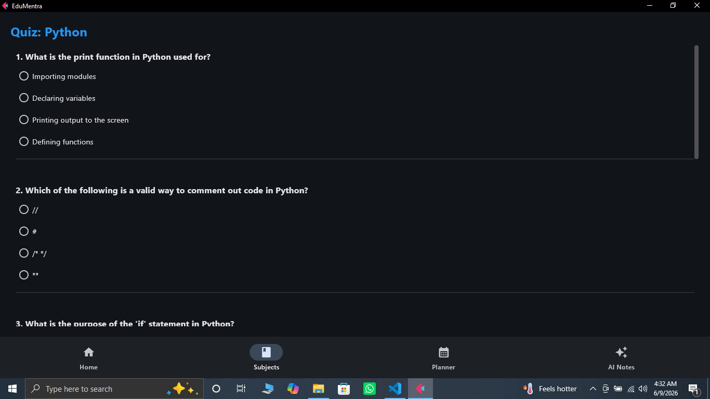

# 📚 EduMentra — AI-Powered Study Companion

> A modern desktop app that helps students plan smarter, learn faster, and prepare for exams with AI-assisted notes and practice quizzes.

[](https://www.python.org/)
[](https://flet.dev/)
[](https://www.sqlite.org/)

---

## ✅ Project Description
EduMentra is an AI-powered desktop application designed to reduce the stress of studying. Instead of juggling folders, reminders, and messy notes, you get a single place to:
- organize what you’re studying,
- transform uploaded notes (photos/screenshots) into structured summaries,
- generate quiz questions to test your understanding,
- plan daily progress and track improvement over time.

It’s built for real study workflows—so you spend less time organizing and more time learning.

---

## 🤔 Why EduMentra Was Built
Studying isn’t just reading—it’s *staying organized* and *staying consistent*.

Many students struggle with:
- forgetting what they studied (no clear progress tracking),
- not knowing what to review next (weak exam preparation),
- spending hours turning notes into something usable,
- practicing with quizzes inconsistently or not at all.

EduMentra was created to solve that gap with an experience that feels like a professional productivity tool, enhanced by AI.

---

## ✨ Key Features

### 🧠 Knowledge Hub (Subjects & Topics)
Organize your learning in a clear hierarchy.
- Create subjects
- Add topics under each subject
- Track topic progress as you practice

### 📸 AI Knowledge Integrator
Upload a photo or screenshot of your notes and get AI-generated study output, including:
- structured summaries
- key concepts
- exam-style questions

This helps you quickly convert raw notes into a study-ready format.

### ❓ Interactive Quiz System
Turn a topic into practice questions.
- Generate a quiz automatically using AI
- Answer interactively inside the app
- Track your quiz history and progress

### 📅 Daily Planner with Progress Tracking
Set daily learning targets and stay accountable.
- Add study tasks for each date
- Mark tasks complete as you go
- Build consistent study habits

### 📝 Study Management Tools
Keep everything connected:
- AI notes can be saved to topics
- quizzes improve your topic progress score

---

## 🖼️ Screenshots

> Replace or add more screenshots as your UI evolves.

### Home


### Daily Planner


### AI Notes


### Quiz System


---

## 🎥 Demo Video

- Demo video: `YOUR_DEMO_VIDEO_LINK_HERE`

---

## 🛠️ Installation Instructions

### 1) Requirements
- Python 3.10+
- A Groq API key (for AI features)

### 2) Clone the repository
```bash
git clone <your-repo-url>
cd EduMentra
```

### 3) Create a virtual environment (recommended)
```bash
python -m venv venv
venv\Scripts\activate
```

### 4) Install dependencies
```bash
pip install -r requirements.txt
```

### 5) Run the application
```bash
python main.py
```

> **Note on AI API Key**: EduMentra’s AI features require a Groq API key. For best security, avoid hardcoding API keys in code and use environment variables instead.

---

## 📖 Usage Guide

### 1) Add a Subject
1. Open **Home**
2. Enter a subject name
3. Click **Add**

### 2) Create Topics
1. Open **Subjects**
2. Select a subject
3. Add topics under it

### 3) Generate AI Notes (Integrate Study Material)
1. Open **AI Notes**
2. Upload a photo/screenshot of your notes
3. Review the AI-generated summary, key concepts, and questions
4. Save the result to a topic

### 4) Practice with Quizzes
1. Pick a topic in **AI Notes**
2. Generate a quiz
3. Answer questions and view your score
4. Your topic progress updates automatically

### 5) Plan Your Day
1. Open **Planner**
2. Add tasks for the date
3. Mark tasks complete as you study

---

## 🧰 Technology Stack

- **Python** 🐍
- **Flet** (desktop UI framework)
- **SQLite** (local persistence)
- **Groq API** (Llama-based quiz generation + vision-based note analysis)
- **Pillow** (image processing)

---

## 🔮 Future Improvements
Here are directions to make EduMentra even better:
- 🌙 True dark theme consistency across all components (full UI polish)
- 🔁 Smarter revision scheduling (spaced repetition)
- 🧾 Export study summaries (PDF/Markdown/Docx)
- 📊 Rich analytics dashboard (time studied, topic mastery trends)
- 🖼️ Support for more media types (where feasible)
- 🤝 Community feature set (shared templates and question banks)

---

## 🤝 Contributing
Contributions are welcome! 🚀

1. Fork the repository
2. Create a feature branch (`blackboxai/<name>` or your own naming)
3. Commit your changes
4. Push to the branch
5. Open a Pull Request

---

## 💬 Feedback and Suggestions
If you have ideas, bug reports, or feature requests:
- Open an issue
- Share your proposed UX improvements
- Provide sample study material and expected output format

---

## 👤 Author Information
- **Project Author:** EduMentra Team
- **Built with ❤️ for students who want to study smarter**

---

### 📌 License
See [`LICENSE`](LICENSE) for details.

